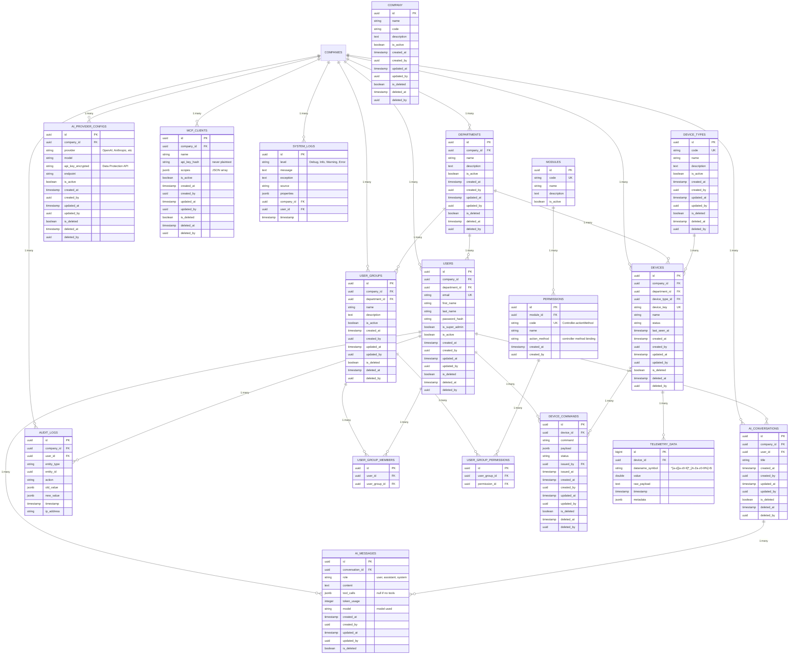

# IoTPlatform — Entity-Relationship Diagram

This diagram is the source-of-truth visualization of the database schema described in
[`CLAUDE.md` §7](../CLAUDE.md). It renders automatically on GitHub.

## Key conventions

- **Every entity** carries audit fields (`created_at/by`, `updated_at/by`, `is_deleted`,
  `deleted_at/by`) via `AuditableEntity`; tenant-scoped entities add `company_id` via `TenantEntity`.
- **Permissions bind to controller action methods** — `code = "{Controller}.{actionMethod}"`
  (e.g. `Users.createUser`). There is no `PermissionAction` enum.
- **Telemetry posts directly at the device level.** The sensor layer is hidden — there is no
  `sensors` table. Each reading is identified by `dataname_symbol` (e.g. `temperature_C`),
  validated on ingestion.

